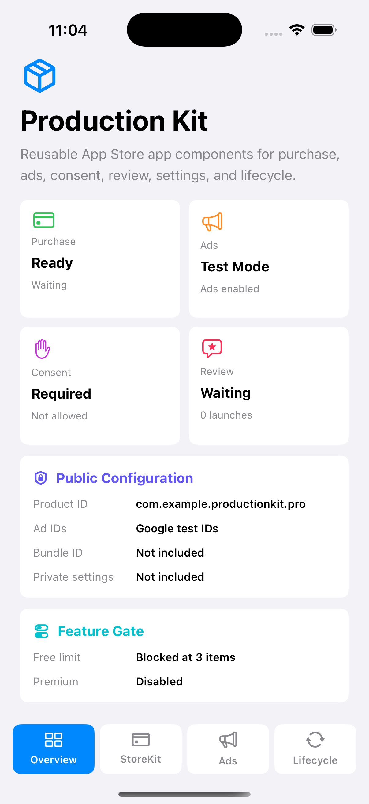
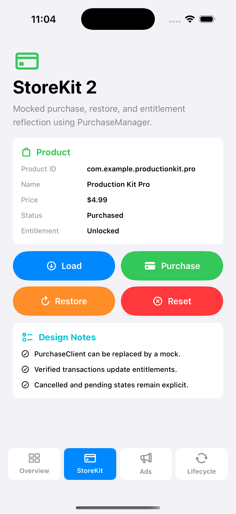
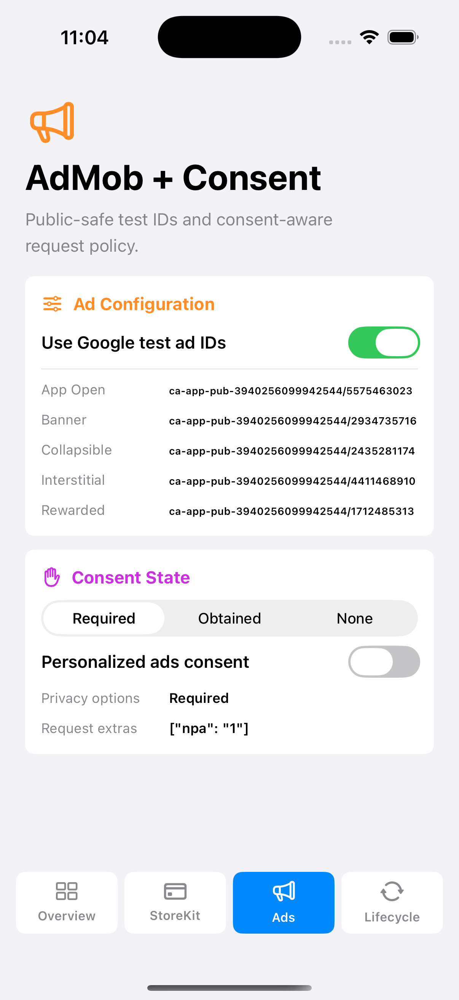
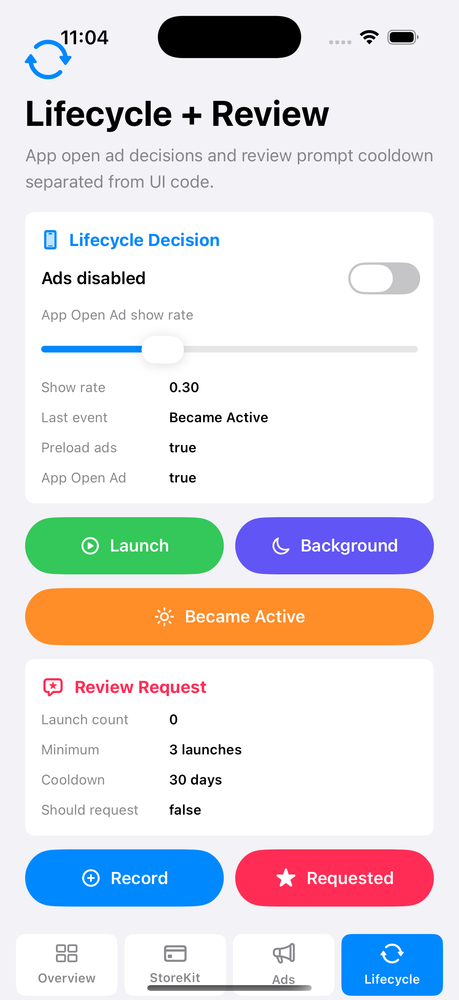

# iOS App Store Production Kit

## 概要

このリポジトリは、App Store 向け iOS アプリでよく使う production-oriented な共通実装をまとめた公開用サンプルです。

StoreKit 2 による購入 / 復元 / Entitlement 反映、AdMob の設定管理、GDPR / consent 管理、レビュー依頼、ローカライズ、アプリ設定、エラーハンドリング、アプリライフサイクル処理などを、アプリ本体から切り出して確認しやすい形に再構成しています。

商用アプリのコードをそのまま公開するのではなく、実装パターンや設計方針を確認できるライブラリ / サンプル集として構成しています。公開用のため、bundle ID、App ID、IAP ID、AdMob ID、package name、アイコン、商用アプリ固有の内部設定などは含めていません。

## Demo

このサンプルは Swift Package として構成しており、`swift test` で主要ロジックの動作を確認できます。 `Examples/ProductionKitDemo/` には SwiftUI のデモアプリを含めています。

iPhone Simulator で実行する場合は、`Examples/ProductionKitDemoIOS/ProductionKitDemoIOS.xcodeproj` を開いて `ProductionKitDemoIOS` scheme を実行してください。

スクリーンショットを `docs/screenshots/` に配置しています。

- `01-overview.png`: kit全体の構成と公開用設定
- `02-storekit-purchase.png`: StoreKit 2 の購入 / 復元 / Entitlement
- `03-admob-consent.png`: AdMob test ID と consent 状態
- `04-lifecycle-review.png`: App lifecycle とレビュー依頼制御

追加の確認用として、`05-storekit-restore.png`、`06-admob-production-placeholder.png`、`07-review-eligible.png` も同じフォルダに保存しています。

<p>
  
  
  
  
</p>

## 主な内容

- StoreKit 2 による購入 / 復元 / Entitlement 反映
- StoreKit 依存を差し替えられる `PurchaseClient` 設計
- Pro 解放や無料制限を扱う Feature Gate
- `UserDefaults` ベースの Entitlement 管理
- AdMob の ad unit 管理
- Google 公式テスト広告IDを使った公開用設定
- GDPR / UMP などを想定した consent flow の抽象化
- パーソナライズ広告 / 非パーソナライズ広告の request policy
- App Open Ad 表示判断を含む lifecycle helper
- レビュー依頼の launch count / cooldown 管理
- Codable な app settings store
- fallback 文字列つき localization helper
- `LocalizedError` を前提にした error model
- 単体テスト

## 技術スタック

- Swift
- Swift Package Manager
- StoreKit 2
- Foundation
- UserDefaults
- Swift Concurrency
- Swift Testing
- Google Mobile Ads を想定した AdMob configuration
- Google UMP を想定した consent abstraction

## Skills

- App Store アプリ向けの共通処理の切り出し
- StoreKit 2 の購入、復元、Entitlement 管理
- IAP 処理をテストしやすくする依存分離
- Pro / Free の機能制限ロジック設計
- AdMob の本番IDを公開せずにサンプル化する構成
- GDPR / consent flow をアプリ本体から分離する設計
- App Open Ad や広告 preload を考慮した lifecycle 処理
- レビュー依頼の頻度制御
- `UserDefaults` を使った軽量な設定保存
- 日本語 / 英語を前提にしたローカライズ helper
- Swift Package として再利用しやすい構成
- 公開リポジトリ向けの識別子・内部設定の除外

## Architecture

```text
ios-appstore-production-kit/
├── Package.swift
├── Sources/
│   └── AppStoreProductionKit/
│       ├── Ads/
│       │   └── AdConfiguration.swift
│       ├── Consent/
│       │   └── ConsentCoordinator.swift
│       ├── ErrorHandling/
│       │   └── AppError.swift
│       ├── Lifecycle/
│       │   └── AppLifecycleCoordinator.swift
│       ├── Localization/
│       │   └── LocalizationHelper.swift
│       ├── Review/
│       │   └── ReviewRequestManager.swift
│       ├── Settings/
│       │   └── AppSettingsStore.swift
│       └── StoreKit/
│           ├── PurchaseManager.swift
│           ├── EntitlementStore.swift
│           └── FeatureGate.swift
├── Tests/
│   └── AppStoreProductionKitTests/
│       └── AppStoreProductionKitTests.swift
├── Config/
│   └── ProductionKit.example.plist
├── docs/
│   ├── AdMob.md
│   ├── Consent.md
│   ├── StoreKit2.md
│   └── screenshots/
└── Examples/
    ├── ProductionKitDemo/
    │   ├── ProductionKitDemoApp.swift
    │   ├── DemoViewModel.swift
    │   └── DemoRootView.swift
    └── ProductionKitDemoIOS/
        ├── ProductionKitDemoIOS/
        │   └── ProductionKitDemoIOSApp.swift
        └── ProductionKitDemoIOS.xcodeproj
```

責務の分け方:

- `Ads`: AdMob の ad unit、テスト広告ID、非パーソナライズ広告 request policy
- `Consent`: GDPR / UMP などを想定した consent 状態管理
- `Lifecycle`: 起動、復帰、バックグラウンド移行時の広告 preload / App Open Ad 判断
- `Review`: レビュー依頼の launch count と cooldown 管理
- `Settings`: Codable なアプリ設定の保存 / 読み込み
- `StoreKit`: StoreKit 2 の購入、復元、Entitlement、Feature Gate
- `Tests`: 公開サンプルとして重要なロジックのテスト
- `Config`: 本番値を含まない公開用の設定例
- `Examples/ProductionKitDemo`: macOS版とiOS版で共有するスクリーンショット用SwiftUI画面
- `Examples/ProductionKitDemoIOS`: iPhone Simulator撮影用の薄いXcodeプロジェクト
- `docs`: 実装方針、公開前チェックリスト、スクリーンショット

## StoreKit Demo

公開用サンプルの商品IDは、以下のような値を前提にしています。

```text
com.example.productionkit.pro
```

`PurchaseManager` は `PurchaseClient` に依存しているため、StoreKit 本体や App Store Connect の本番商品を使わずに、購入 / 復元 / Entitlement 反映の流れを単体テストで確認できます。

```swift
let manager = PurchaseManager(
    productID: "com.example.productionkit.pro"
)

let products = try await manager.loadProducts()
let outcome = try await manager.purchase()
```

## AdMob Demo

AdMob の本番IDは含めていません。公開用サンプルでは、Google 公式テスト広告IDを使用しています。

```swift
let configuration = AdConfiguration(usesTestAds: true)
let interstitialID = configuration.adUnitID(for: .interstitial)
```

本番アプリに組み込む場合は、`Config/ProductionKit.example.plist` を参考にして、アプリ側の target や CI の secret 管理から実値を渡す想定です。

## Setup

このリポジトリは Swift Package として利用できます。

Xcode で確認する場合は、`Package.swift` を開いてください。

macOS版の SwiftUI Demo を起動する場合:

```bash
swift run ProductionKitDemo
```

iPhone Simulator で撮影する場合:

```text
Examples/ProductionKitDemoIOS/ProductionKitDemoIOS.xcodeproj
```

Xcode で開き、`ProductionKitDemoIOS` scheme を iPhone Simulator で実行してください。


## 公開用サンプルとして除外しているもの

このリポジトリには、以下を含めていません。

- 商用アプリのソースコード一式
- 商用アプリの実 bundle ID
- 実 App ID
- 実 IAP product ID
- 実 AdMob app ID
- 実 AdMob ad unit ID
- 実 Team ID
- 本番用アイコン
- 商用アプリ固有の内部設定
- App Store Connect の本番設定
- APIキー
- 非公開素材
- ユーザーデータ
- 収益情報
- 審査対応メモ

## 関連リポジトリ

- [mobile-app-portfolio](https://github.com/nomazzo/mobile-app-portfolio): 全体のアプリポートフォリオ説明
- [ios-photo-editor-sample](https://github.com/nomazzo/ios-photo-editor-sample): ペインティング風カメラアプリの公開用サンプル
- [ios-utility-app-sample](https://github.com/nomazzo/ios-utility-app-sample): ホームタスク管理アプリの公開用サンプル
- [android-photo-editor-sample](https://github.com/nomazzo/android-photo-editor-sample): Androidフォトエディターの公開用サンプル

## Public Demo Notes

このプロジェクトは公開用ポートフォリオです。本番の App Store 商品、AdMob アカウント、バックエンド、分析基盤、商用URLには接続していません。

識別子は `com.example...` のサンプル値を使用しています。AdMob は Google 公式テスト広告IDを使用し、本番IDは `ProductionKit.example.plist` の構成例だけを示しています。

`ca-app-pub-3940256099942544/...` は Google 公式テスト広告IDです。
